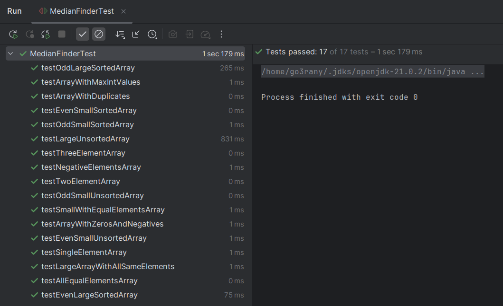
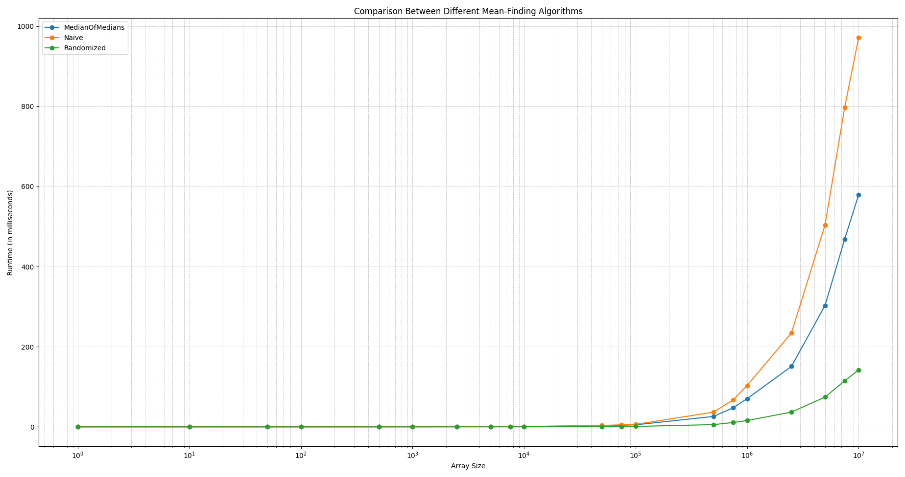

# Median Finding Algorithms Analysis

## Introduction

This report provides a comprehensive analysis of three different median finding algorithms: Naive Median Finder, Randomized Median Finder, and Median of Medians. Each algorithm has unique characteristics and performance profiles, which we will explore through theoretical discussions and empirical analysis.

## Implemented Algorithms

### 1. Naive Median Finder

The Naive Median Finder algorithm is straightforward: it sorts the input array and selects the k-th element from the sorted array. While simple, this approach has a time complexity of $O(n\cdot log ⁡n)$.

**Code Snippet**

```java
public class NaiveMedianFinder extends MedianFinder {
  public NaiveMedianFinder(int[] dataPoints) {
      super(dataPoints);
  }

  @Override
  public int select(int l, int r, int k) {
      // naively sort the elements then return sorted[k]
      int [] sorted = this.dataPoints;
      Arrays.sort(sorted);
      return sorted[k];
  }
}
```

### 2. Randomized Median Finder

The Randomized Median Finder algorithm leverages randomization of selecting a pivot to partition array to achieve an average time complexity of $O(n)$, though its worst-case time complexity is $O(n^2)$.

**Code Snippet:**

```java
@Override
public int select(int l, int r, int k) {
  if (l == r) {
      return this.dataPoints[l];
  }
  // we partition the data points around a random pivot, into 3 groups
  // [..less than..|..equal..|..greater..than]
  // partitioning returns the range of elements equal to the pivot
  int[] m = this.randomizedPartition(l, r);
  // the max rank is the rank of the most right equal element
  int rankMax = m[1]-l;
  // the min rank is the rank of the most left equal element
  int rankMin = m[0]-l;
  if (k >= rankMin && k <= rankMax) {
      // if k is in that range then we just return the pivot
      return this.dataPoints[m[0]];
  }
  else if (k < rankMin) {
      // else we neglect all elements greater than or equal to the pivot
      return select(l, m[0] - 1 , k);
  }
  else {
      // else we neglect all elements smaller than or equal to the pivot
      return select(m[1] + 1, r, k - rankMax - 1);
  }
```

### 3. Median of Medians Algorithm

The Median of Medians algorithm is a deterministic approach with a guaranteed linear time complexity of $O(n)$. It works by dividing the array into smaller groups of 5, finding the median of each group, and then recursively finding the median of these medians. This approach ensures a good pivot choice, leading to efficient partitioning and selection.
****

**Code Snippet:**

```java
@Override
public int select(int l, int r, int k) {
if (r-l+1 <= 5) {
    // if we have less than 5 elements, we naively get the kth element
    Arrays.sort(dataPoints, l, r + 1);
    return dataPoints[l + k];
}
int numOfMedians = (r - l + 1 + 4) / 5;
int[] medians = new int[numOfMedians];
// counter for number of medians
int cnt = 0;
for (int i = l; i <= r; i += 5) {
    // we get the 5 elements that include ith element
    int [] five = Arrays.copyOfRange(dataPoints, i, Math.min(i + 5, r + 1));
    Arrays.sort(five);
    // add the median of the five elements
    // (they might be less than five if the array length is not divisible by 5)
    medians[cnt++]= ( five[five.length / 2 - 1 + (five.length % 2)] );
}
int[] exactMedians = Arrays.copyOf(medians, cnt);
// get the median of medians by recursive call with but with new array "medians"
// which has approx length n/5
int medianOfMedians = new DeterministicLinearTimeMedianFinder(exactMedians)
												.getMedian();

// we partition the data points around the median of medians, into 3 groups 
// [..less than..|..equal..|..greater..than]
int pivotIndex = 0;
for (int i = l; i <= r; i++){
    if (this.dataPoints[i]==medianOfMedians){
        pivotIndex=i;
        break;
    }
}
// we make the pivot at the start
this.swapDataPoints(pivotIndex, l);
// partitioning returns the range of elements equal to the pivot
int[] m = this.partition(l, r);
// the max rank is the rank of the most right equal element
int rankMax = m[1]-l;
// the min rank is the rank of the most left equal element
int rankMin = m[0]-l;
if (k >= rankMin && k<= rankMax) {
    // if k is in that range then we just return the pivot
    return this.dataPoints[m[0]];
}
else if (k < rankMin) {
    // else we neglect all elements greater than or equal to the pivot
    return select(l, m[0] - 1 , k);
}
else {
    // else we neglect all elements smaller than or equal to the pivot
    return select(m[1] + 1, r, k - rankMax - 1);
}
}

```

## Further Implementation Details:

## 1. Correctness Testing

To ensure the correctness of the implemented algorithms, I developed 17 **JUnit** tests with diverse scenarios for each algorithm.

**Example JUnit Test:**

```java
@Test
public void testOddSmallUnsortedArray() {
    // 2 5 5 7 12 13 19 23 255 997 1243
    int[] arr = {5, 12, 255, 23, 1243, 5, 56, 2, 7, 13, 19, 997};
    testMedian(arr, 13);
}
```



## 2. Three-Way Partitioning

I implemented three-way partitioning to optimize the performance of the algorithms, especially in cases with many **duplicate** elements. This technique divides the array into three segments: elements **less** than the pivot, elements **equal** to the pivot, and elements **greater** than the pivot.

### Code Snippet:

```java
protected int[] partition(int l, int r) {
  int pivot = this.dataPoints[l]; // let the pivot be the first element
  int less = l; // pointer after less than partition
  int greater = r; // pointer before greater than partition
  for (int i = l+1; i <= greater ; ) {
      if (this.dataPoints[i] < pivot) {
          // if current element is less than pivot, 
          // we add it to less than partition and increase "less"
          swapDataPoints(less, i);
          less++;
          i++; // go to next element
      }
      else if (this.dataPoints[i] > pivot) {
          // if current element is greater than pivot,
          // we add it to greater than partition and decrease "greater"
          swapDataPoints(greater, i);
          greater--;
      }
      else {
          // if current element is equal to the pivot we skip it
          i++;
      }
  }
  // we return range of the equal-to-the-pivot elements
  return new int[]{less, greater};
}

// helper function to swap two elements in the dataPoints array,
// at index i and index j
protected void swapDataPoints(int i, int j) {
  int temp = this.dataPoints[i];
  this.dataPoints[i] = this.dataPoints[j];
  this.dataPoints[j] = temp;
}

```

## Performance Analysis

To analyze the performance, I generated **random** input arrays of varying sizes and ensured all three algorithms produced the same median. I used the **factory** design pattern to dynamically select the desired algorithm.

**Factory Method:**

```java
public MedianFinder getMedianFinder(String algorithm_name, int [] array) {
    switch (algorithm_name) {
        case "Naive":
            return new NaiveMedianFinder(array);
        case "MedianOfMedians":
            return new DeterministicLinearTimeMedianFinder(array);
        case "Randomized":
            return new RandomizedMedianFinder(array);
    }
    return new RandomizedMedianFinder(array);
}
```

## Runtime Analysis

For each input size up to $10^7$, `numberOfSamples` iterations were performed, with each iteration generating a new random array. Each algorithm was then applied to these arrays, and the average runtime was measured over the `numberOfSamples`. The results were compiled into a table, providing a clear comparison of the algorithms' performance. Here we used `numberOfSamples = 100`.

### **Table of Analysis Results:**

| **Array Size** | **MedianOfMedians (milliseconds)** | **Naive (milliseconds)** | **Randomized (milliseconds)** |
| --- | --- | --- | --- |
| 1 | 0.00 | 0.01 | 0.01 |
| 10 | 0.01 | 0.01 | 0.01 |
| 50 | 0.01 | 0.04 | 0.00 |
| 100 | 0.02 | 0.02 | 0.00 |
| 500 | 0.08 | 0.09 | 0.01 |
| 1000 | 0.16 | 0.14 | 0.02 |
| 2500 | 0.27 | 0.26 | 0.05 |
| 5000 | 0.48 | 0.60 | 0.03 |
| 7500 | 0.80 | 0.57 | 0.16 |
| 10000 | 0.81 | 0.90 | 0.16 |
| 50000 | 3.29 | 3.49 | 0.66 |
| 75000 | 4.18 | 5.15 | 0.91 |
| 100000 | 5.02 | 6.26 | 1.09 |
| 500000 | 26.03 | 36.78 | 5.59 |
| 750000 | 47.60 | 67.40 | 10.83 |
| 1000000 | 70.34 | 103.16 | 15.68 |
| 2500000 | 150.93 | 234.41 | 36.89 |
| 5000000 | 303.11 | 503.89 | 74.28 |
| 7500000 | 468.64 | 797.39 | 114.88 |
| 10000000 | 579.26 | 971.37 | 142.03 |
- After seeing the table of analysis, I decided to output the table as CSV, read it into a dataframe using a Python script, and plot the results using matplotlib.



### Discussion and Conclusion

- Although the Randomized Median Finder has a worst-case time complexity of $O(n^2)$, it performs very well in practice. The Median of Medians algorithm, despite its theoretical $O(n)$ time complexity, has high constant factors that result in overhead, making it close in performance to the Naive approach.